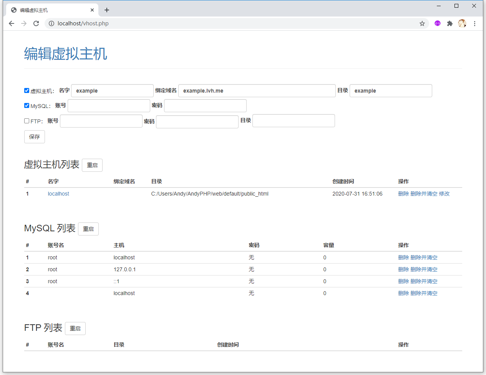

# AndyPHP - PHP 运行环境一键安装包

能够在线开设虚拟主机、FTP、MySQL。适用于 x64 位系统，支持: Windows 7 SP1, Vista SP2, 8 / 8.1, Windows 10, Server 2008 SP2 / R2 SP1, Server 2012 / R2, Server 2016。

集成以下环境：

Apache 2.4.29 Win64

PHP 5.6 (5.6.32) VC11 x64 Thread Safe

MariaDB 10.2 Series

FileZilla Server 0.9.60

Adminer 4.6.2

Caddy v1.0.3_windows_amd64_custom_personal with hook.service plugin

## 下载

https://github.com/mingfunwong/AndyPHP/archive/master.zip

## 提示

1. 启动 Apache 需要系统安装有 VC15 环境，可到 tool/DirectX Repair V3.5/DirectX_Repair_win8_win10.exe 一键安装。

2. MySQL 账号： root 密码：空 ，建议访问 http://127.0.0.1/reset_mysql.php 重设密码。

3. 虚拟主机编辑 账号：admin 密码：admin

## 使用方法

编辑 `apahce\conf\httpd.conf`
修改 Define SRVROOT "c:/Apache24" 改为当前目录，如 D:/AndyPHP/apache

运行 start 即可启动 Apache 和 MySQL 服务。

运行 ftp_start 启动 FTP 服务。

## 修改虚拟主机

访问 http://localhost/vhost.php 可在线编辑。

## Author

[Mingfun Wong](https://github.com/mingfunwong)

## License

MIT License
