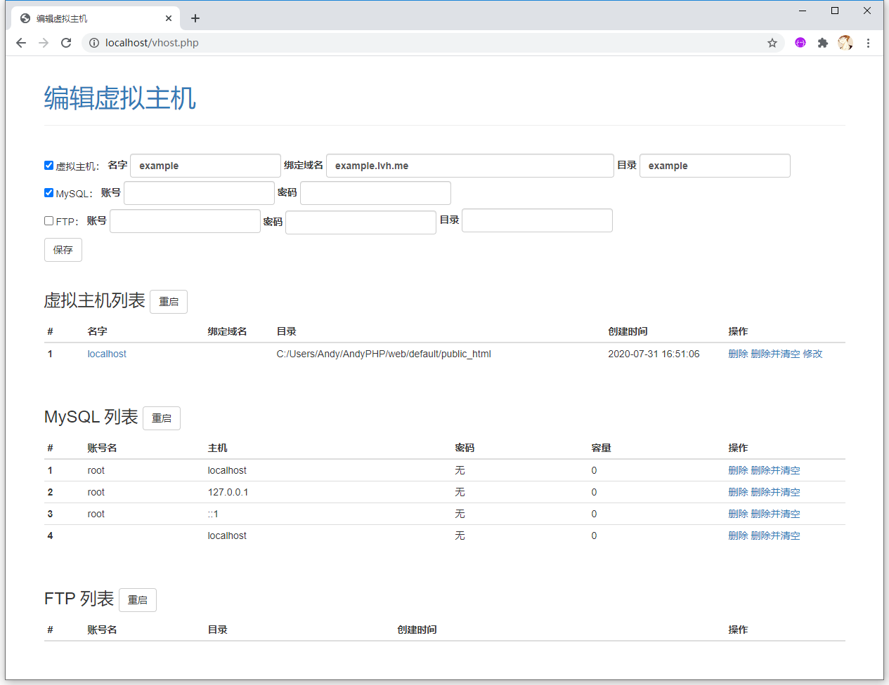

# AndyPHP - PHP 运行环境一键安装包

能够在线开设虚拟主机、FTP、MySQL。适用于 x64 位系统，支持系统： Windows 11。

集成以下环境：

Apache 2.4.62 Win64

PHP 8.1.29 VS16 x64 Thread Safe

MySQL 8.0.25

FileZilla Server 0.9.60.2

Adminer 4.8.1

## 下载

https://github.com/mingfunwong/AndyPHP/archive/master.zip

## 提示

- MySQL 账号： root 密码：root ，建议访问 http://127.0.0.1/reset_mysql.php 重设密码。

## 使用方法

编辑 `apahce\conf\httpd.conf`
修改 Define SRVROOT "C:/AndyPHP/apache" 改为当前目录，如 D:/AndyPHP/apache

运行 start 即可启动 Apache 和 MySQL 服务。

运行 ftp_start 启动 FTP 服务。

## 修改虚拟主机

访问 http://localhost/vhost.php 可在线编辑。账号：admin 密码：admin

## Author

[Mingfun Wong](https://github.com/mingfunwong)

## License

MIT License
